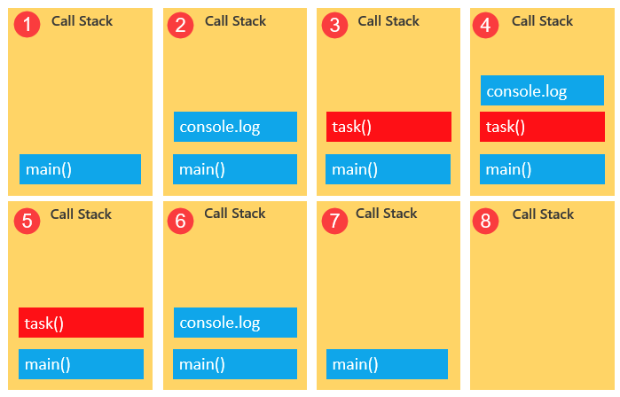

> 👉🏻 JavaScript의 런타임 모델은 코드의 실행, 이벤트의 수집과 처리, 큐에 대기 중인 하위 작업을 처리하는 **이벤트 루프**에 기반하고 있습니다.

## 이벤트 루프


- 힙: 단순히 메모리 영역을 지칭하는 용어. 메모리 할당이 이루어지는 곳으로 변수 등의 정보 저장.
  - (콜스택의 최상단에 있는 실행 컨텍스트가 실행되면서 참조되는 객체들이 저장되어 있는 메모리 공간)
- 콜스택: 실행하는 코드를 순서대로 실행하는 곳
  - (실행 컨텍스트가 추가되거나 제거되며 코드의 실행순서를 관리)
- 콜백큐: 처리할 메시지의 대기열
  - (비동기 함수의 콜백함수 또는 이벤트 핸들러가 일시적으로 대기)

<br/>

### 예제로 콜스택 내부 확인하기

```jsx
// main

function task(message) {
  // emulate time consuming task
  let n = 10000000000;
  while (n > 0) {
    n--;
  }
  console.log(message);
}

console.log('Start script...');
task('Call an API');
console.log('Done!');
```



<br/>

### 이벤트루프 작동 확인하기

```jsx
function greet() {
  console.log('Hello!');
}

function respond() {
  return setTimeout(() => {
    console.log('Hey!');
  }, 1000);
}

greet();
respond();
```

1. greet 호출 => respond 호출


2. Web API인 setTimout 호출, setTimeout의 cb 전달


3. cb는 1초뒤에 콜백큐로 전달


4. 콜스택 비어있을 때, 콜백큐에 있던 대기 작업 하나씩 전달


5. cb 실행


<br/>

참고자료

- [https://developer.mozilla.org/ko/docs/Web/JavaScript/EventLoop](https://developer.mozilla.org/ko/docs/Web/JavaScript/EventLoop)
- [https://www.javascripttutorial.net/javascript-event-loop/](https://www.javascripttutorial.net/javascript-event-loop/)
- [JavaScript Visualized: Event Loop](https://dev.to/lydiahallie/javascript-visualized-event-loop-3dif)

```toc

```
