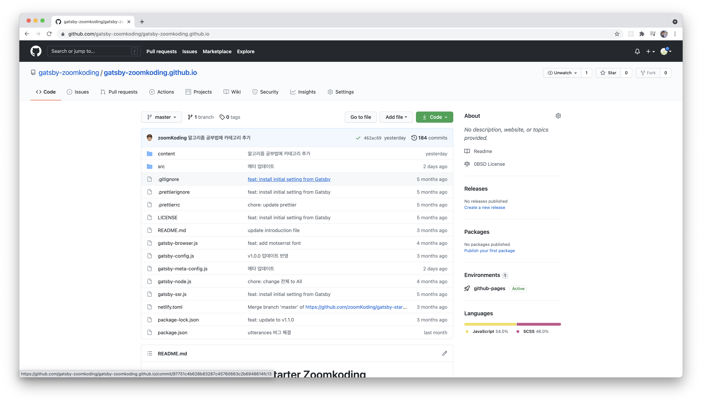
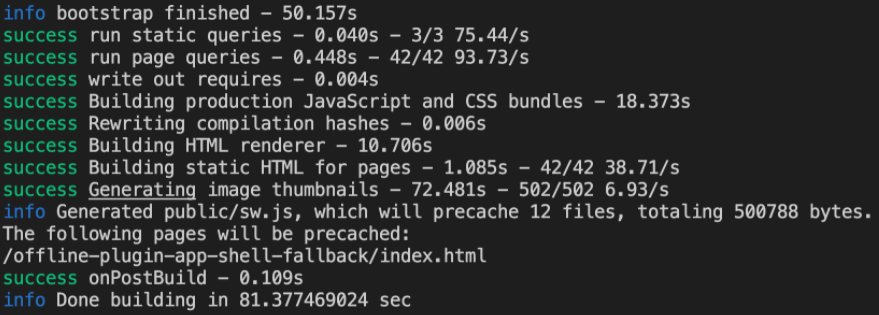
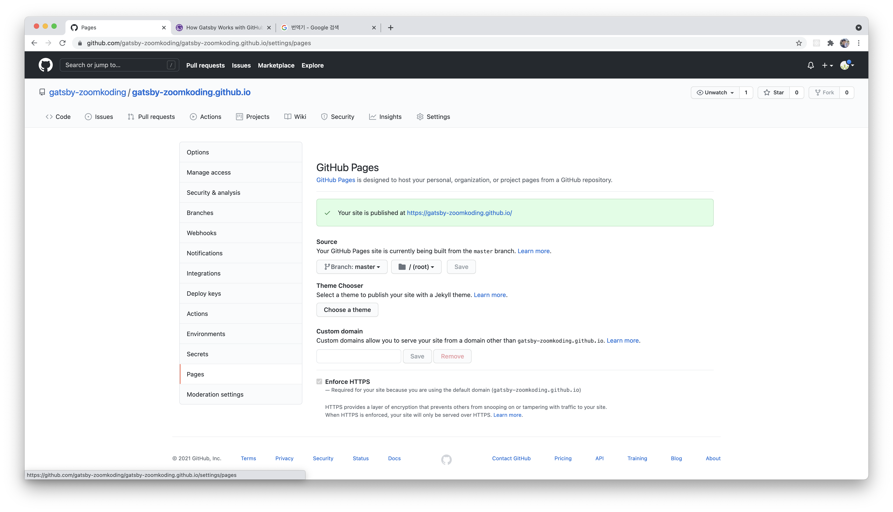
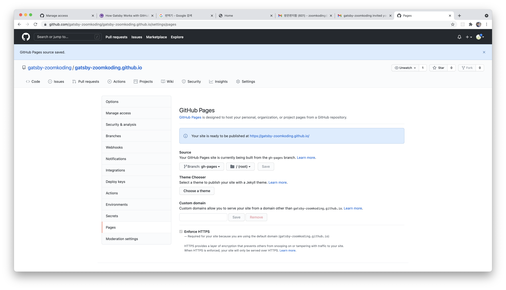

## 1. Repository 생성하기

- 1.  GitHub에 로그인 후 우측 상단에 있는 New Repository 버튼을 클릭하면 repository 생성하기
      
      <br/>
- 2. Import a repository 버튼을 클릭합니다
     
     <br/>
- 3.  생성할 respository 정보 입력하기
      

      - 1. Your old repository's clone URL에 사용할 gatsby 테마가 있는 repository 주소를 넣기
           > 제 블로그 테마는 [https://github.com/zoomKoding/zoomkoding.com](https://github.com/zoomKoding/zoomkoding.com)입니다.
      - 2.  Repository Name을 [GitHubID].github.io로 설정하기
      - 3.  Begin Import 버튼을 클릭하기

    <br/>

- 4. 최종 repository 생성 결과
     

## 2. Repository 가져오기 및 블로그 배포 준비

- 1. Repository에서 초록색 Code 버튼을 클릭하면 링크가 나오게 되는데, 이 링크를 복사하기
     

  <br/>

- 2. 아래 명령어를 수행하여 블로그를 다운로드합니다.

  ```bash
  cd [Repository를 저장할 폴더]
  git clone [복사한 주소]
  ```

  <br/>

- 3. Blog 설치하기

  ```bash
  cd [Repository 주소]
  npm install
  ```

  <br/>

- 4. Blog 배포 준비하기

  ```bash
  npm install gh-pages --save-dev
  ```

  > Gatsby 테마를 GitHub 페이지에 올리기 위해 gh-pages라는 패키지를 설치해야 합니다.

  <br/>

- 5. package.json에 다음을 추가하기

  ```json
  {
    "scripts": {
      "deploy": "gatsby build && gh-pages -d public" // 추가
    }
  }
  ```

<br/>

## 3. Blog 배포하기

- 1. github page에 배포용 build 파일 만들기

  ```bash
  npm run deploy
  ```

  

<br/>

- 2. git add, commit, push 하기

  ```git
  git add .
  git commit -m "commit message"
  git push origin master
  ```

<br/>

- 3.  Repository Source Branch 변경하기

  - 1. Repository에 있는 Settings를 클릭후 죄측 메뉴의 Pages를 클릭하기
       
       <br/>
  - 2. 여기서 Source에 있는 Branch를 master(main)에서 gh-pages로 변경한 후에 저장합니다.
       
       <br/>
  - 3. 배포된 페이지 확인하기 => [GitHubID].github.io에 접근하기
       
       <br/>

<br/>

```toc

```
